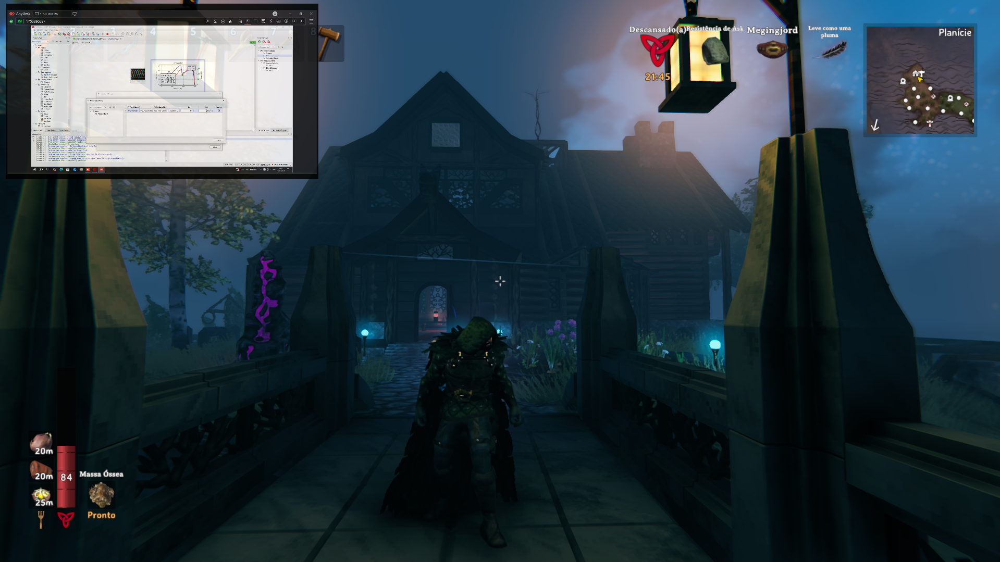
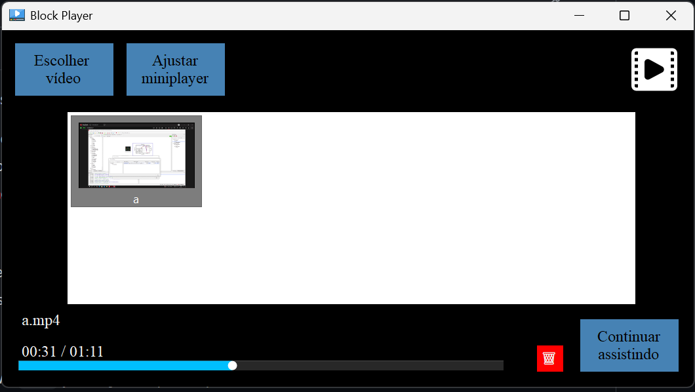

# 🎬 **BLOCK PLAYER**

> Um player simples, leve e funcional para assistir vídeos no Windows

---

## 🧠 O que é?

**Block Player** é um reprodutor de vídeos focado em arquivos **`.mp4`**, ideal para quem gosta de maratonar séries, assistir enquanto joga ou realiza outras atividades no computador.

🪟 **Exclusivo para Windows** | 🎮 **Feito para multitarefa** | 🧩 **Desenvolvido em C#**

---

## ✨ Funcionalidades

* 🧊 **Miniplayer fantasma**
  Assista enquanto joga! O miniplayer:

  * Fica **sempre por cima** das janelas
  * **Não captura cliques**, permitindo interagir com o jogo normalmente
  * Possui **tamanho e opacidade ajustáveis**

  

> Caso utilize o Lossless Scaling, para funcionar corretamente, verifique com a API de captura **WGC**.

* ⏸️ **Continuar assistindo**

  * Retoma seu episódio exatamente de onde parou
  * Histórico rápido e acessível
  

  

* 🖱️ **Arraste seu vídeo**

  * Basta **arrastar o arquivo `.mp4` para a janela** para reproduzir automaticamente

* 🕹️ **Teclas de atalho** personalizadas

  * Navegue e controle sem tocar no mouse!

---

## 🎮 Teclas de Atalho

| Tecla    | Ação                                                 |
| -------- | ---------------------------------------------------- |
| `Espaço` | Pausar / Reproduzir                                  |
| `→`      | Avançar 5 segundos                                   |
| `←`      | Voltar 5 segundos                                    |
| `↑`      | Aumentar volume                                      |
| `↓`      | Diminuir volume                                      |
| `Delete` | Volta do vídeo assistido para a tela inicial         |
| `Enter`  | Maximizar / Restaurar                                |
| `F11`    | Alternar tela cheia                                  |
| `ctrl`+`shift`+`M`      | Atalho global para abrir o miniplayer                |
| `ctrl`+`shift`+`,`      | Retroceder 10 segundos (no miniplayer)               |
| `ctrl`+`shift`+`.`      | Avançar 10 segundos (no miniplayer)                  |

---

## 🛠️ Instalação

### 💻 Windows

📥 Baixe a versão mais recente aqui:
[🔗 Download Block Player (Google Drive)](https://drive.google.com/drive/folders/1SUB9jDSPsZCXWqLadggrI9bIlGbfZ9EY?usp=sharing)

1. Extraia o `.zip`
2. Execute o `BlockPlayerSetup.msi`
3. **Pronto!**

---

## 🐞 Encontrou um bug? Tem sugestões?

Fique à vontade para entrar em contato:
📧 **[igordematosdarosa@gmail.com](mailto:igordematosdarosa@gmail.com)**

Ou crie uma issue aqui no GitHub! 😉

---

## ☕ Me pague um café?

Se o player foi útil pra você e quiser apoiar:
**PIX:** `igordematosdarosa@gmail.com`

> Eu realmente amo café ❤️
